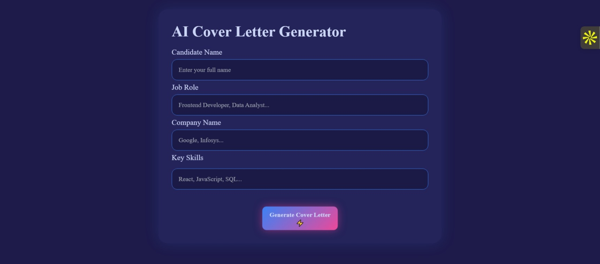
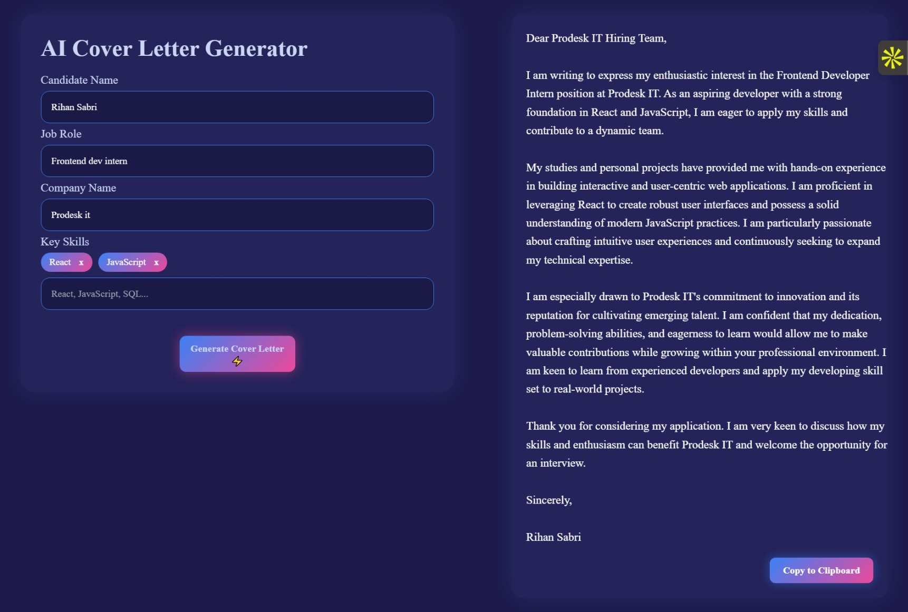
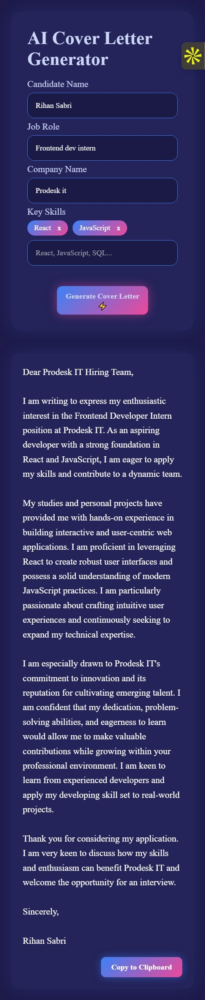

# 🤖 AI Cover Letter Generator

A full-stack SaaS-style web application that generates professional, ready-to-send cover letters using Google Gemini AI.

This project demonstrates real-world architecture with a secure backend, dynamic prompt engineering, production deployment, and a polished frontend UI.

---

## 🚀 Features

- ✨ AI-generated personalized cover letters  
- 🔐 Secure API key handling using environment variables  
- ⚡ Loading state while AI processes requests  
- 🎯 Skill-based customization  
- 📋 One-click copy to clipboard  
- 🌐 Production-ready deployment  
- 📁 Clean frontend/backend separation  
- 🛡️ Git-safe secrets with `.gitignore`

---

## 🛠️ Tech Stack

**Frontend**
- HTML  
- CSS  
- JavaScript  

**Backend**
- Node.js  
- Express.js  
- Google Gemini API  

**Deployment**
- Render  

## 📸 Screenshots

### Desktop Views
<p align="center">
  
</p>
<p align="center">
  
</p>

### Mobile View
<p align="center">
  
</p>


## ⚙️ Environment Setup

Create a `.env` file inside the **backend** folder:

GEMINI_API_KEY=your_api_key_here


⚠️ Never commit `.env` files to GitHub.

## 🧪 Run Locally

### 1. Clone the repository

```bash
git clone <https://github.com/MSabriBoy/AI_CoverLetter_Generator.git >

```
### 2. Install backend dependencies

```bash
cd backend

npm install

```

### 3. Start the Server

```bash
npm start

```

***The server will run at:***

http://localhost:5000

### 4. Open in browser

Visit:

http://localhost:5000
